# list
<html lang="ja">
 <head>
  <meta charset="utf-8" />
 

<link href="https://cdnjs.cloudflare.com/ajax/libs/lightbox2/2.7.1/css/lightbox.css" rel="stylesheet">
   
</head>
<!--
<body onload="alert('雪路はんなりの会の記録〜〜(^o^)/')" onunload="alert('再会の時まで、元気でお過ごしくださいませ〜(^o^)/')">
-->

<h1><marquee behavior="alternate">!!! クラス会名簿 !!!</marquee></h1>

<a href="https://torokoid.github.io/home">Home</a>><a href="https://torokoid.github.io/oizumi">2019年同期会</a>>クラス会名簿

  モバイル端末をお使いの場合は、画面を横向きにするとより見やすくご覧頂けます。

                              
<a href="20190613_001.png" data-lightbox="abc">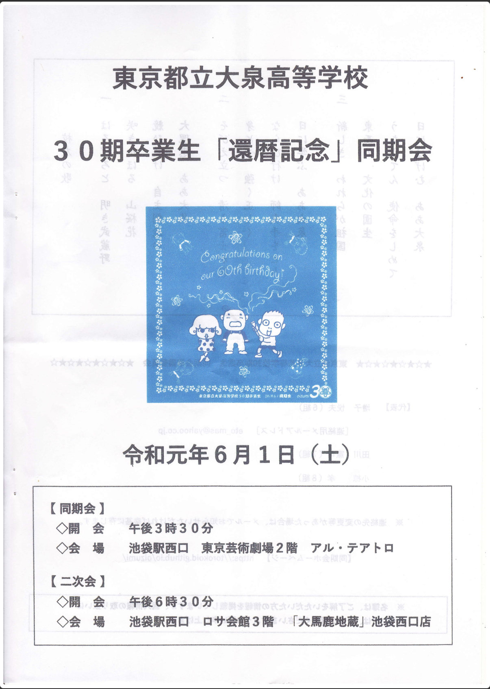</a>
<a href="20190613_002.png" data-lightbox="abc">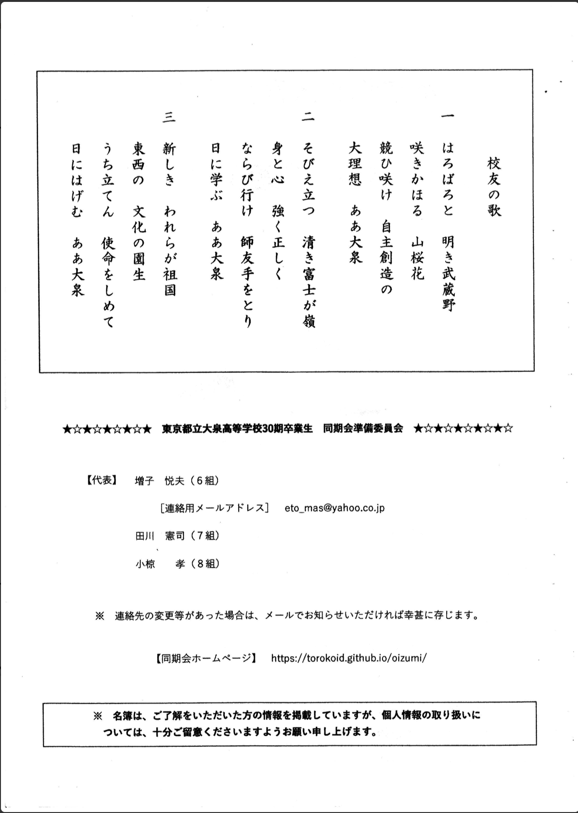</a>
<a href="20190613_003.png" data-lightbox="abc">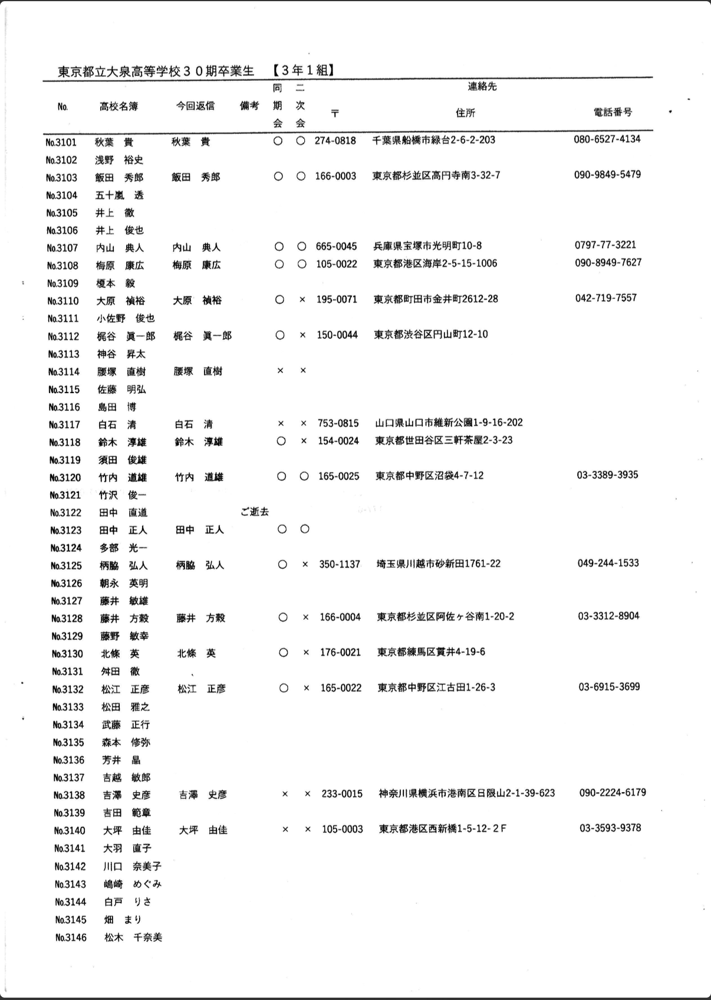</a>
<a href="20190613_004.png" data-lightbox="abc">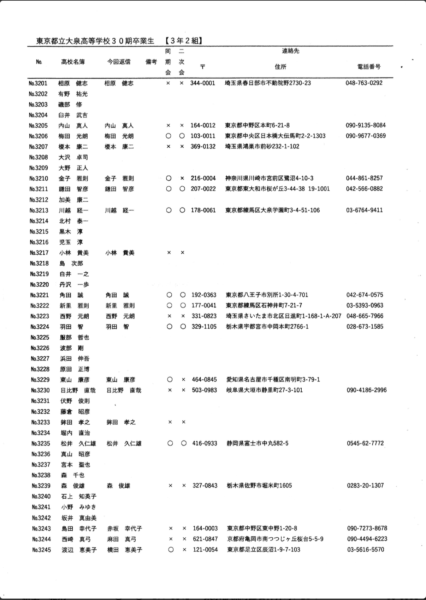</a>
<a href="20190613_005.png" data-lightbox="abc">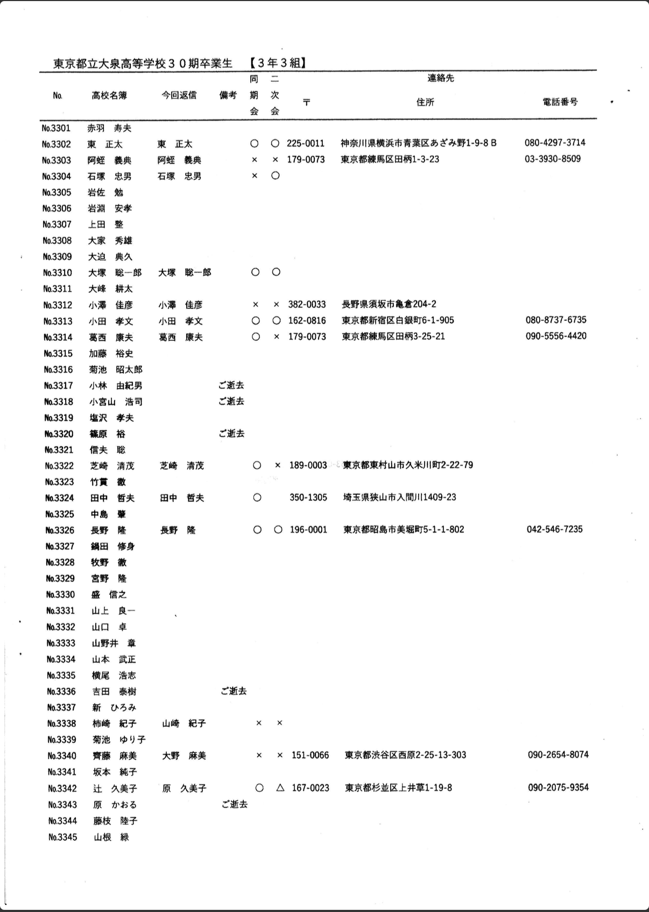</a>
<a href="20190613_006.png" data-lightbox="abc">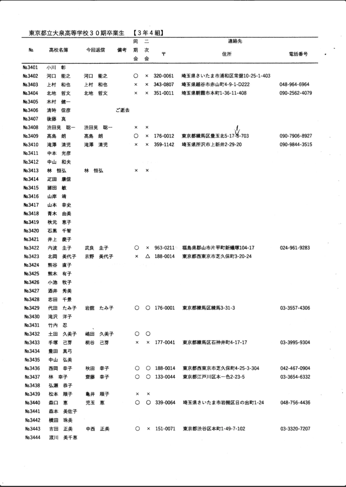</a>
<a href="20190613_007.png" data-lightbox="abc">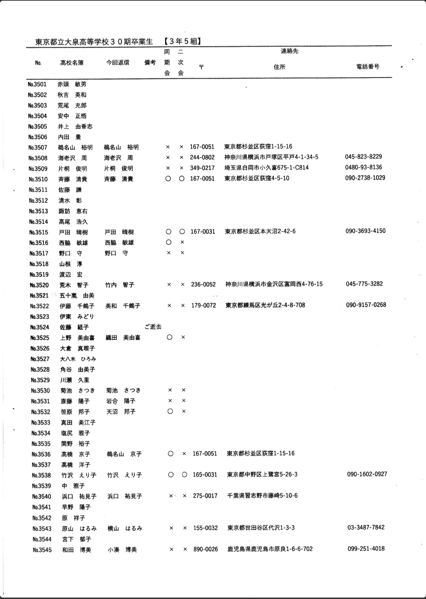</a>
<a href="20190613_008.png" data-lightbox="abc">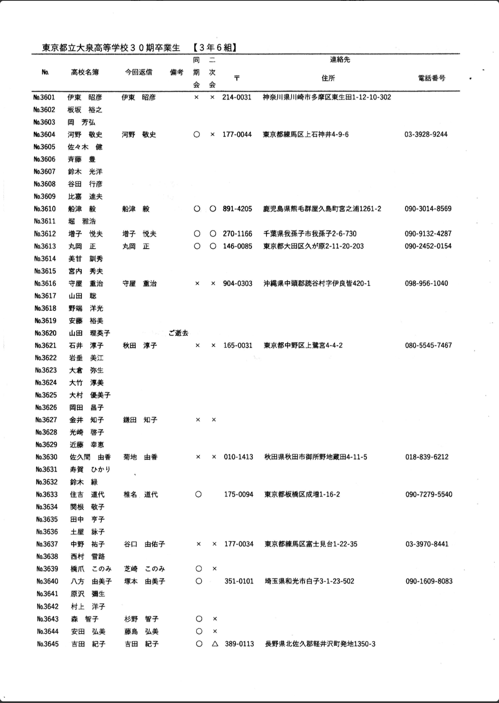</a>
<a href="20190613_009.png" data-lightbox="abc">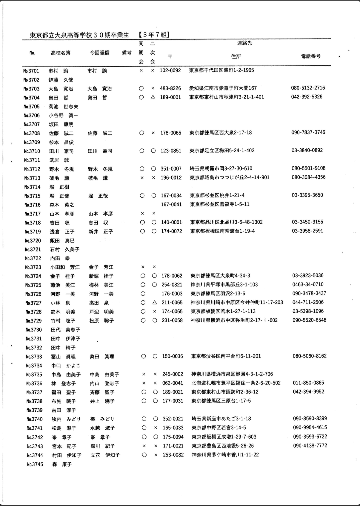</a>
<a href="20190613_010.png" data-lightbox="abc">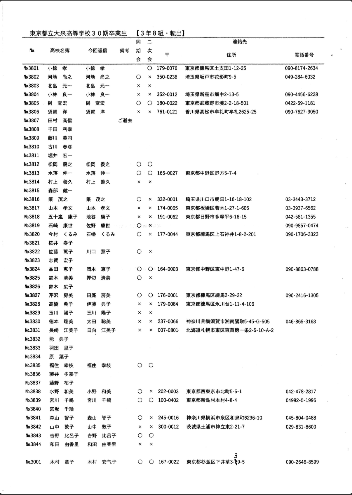</a>
<a href="20190613_011.png" data-lightbox="abc">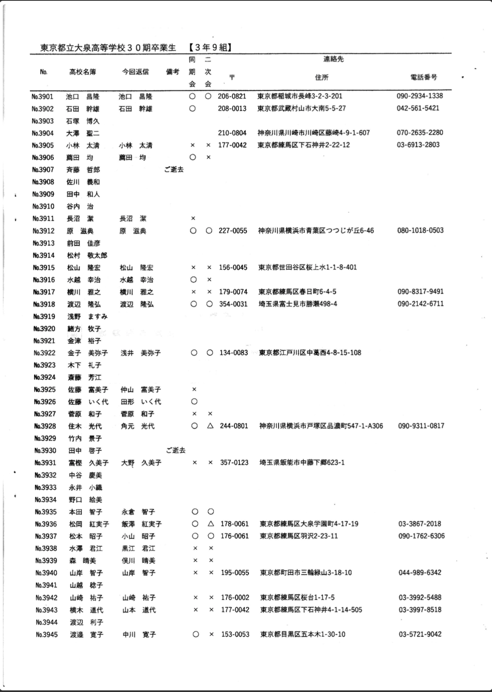</a>
<a href="20190613_012.png" data-lightbox="abc">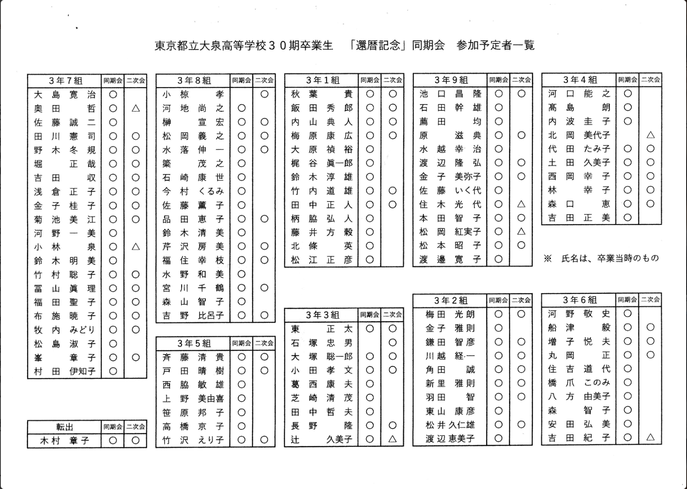</a>
<!--

-->

                              

<section>
<!-- begin wwww.htmlcommentbox.com -->
 
<a href="http://www.htmlcommentbox.com">HTML Comment Box</a> is loading comments...

 <link rel="stylesheet" type="text/css" href="//www.htmlcommentbox.com/static/skins/bootstrap/twitter-bootstrap.css?v=0" />
 
<!-- end www.htmlcommentbox.com -->
</section>

                             
          

<a href="https://torokoid.github.io/oizumi">大泉高校30期のHP　← リンクあり</a>

  

 

<!-- フッタ -->
 <footer>
 Copyright 2019/06/12 Pe-Young(S.Hada)
 </footer>
